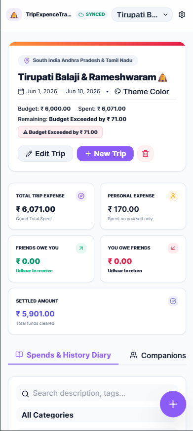

<div align="center">

# ✈️ TripExpenseTracker

### Smart Trip Expense Tracker & Friends Udhaar Khata

Manage your trips, expenses, friends' payments, settlements, travel diary, and complete trip history — all from a single modern web application.


</div>

---

# 📖 About

**TripExpenseTracker** is a modern Progressive Web App (PWA) designed to simplify trip expense management.

Whether you're travelling with friends, family, or colleagues, the app keeps every expense organized while automatically managing who paid, who owes money, settlements, budgets, and travel memories.

No spreadsheets.

No confusion.

Just enjoy your trip.

---

# ✨ Key Features

## 💰 Expense Management

- Add Unlimited Expenses
- Edit & Delete Expenses
- Category Wise Expenses
- Personal Expenses
- Shared Expenses
- Settlement Records
- Payment History
- Budget Tracking
- Overspending Alerts

---

## 👥 Friends Udhaar Khata

- Add Unlimited Friends
- Track Who Paid
- Track Who Owes
- Auto Settlement
- Payment Status
- Outstanding Balance
- Complete Udhaar Register

---

## 📊 Analytics Dashboard

- Total Trip Expense
- Personal Expense
- Friends Owe You
- You Owe Friends
- Settled Amount
- Remaining Budget
- Category Statistics
- Daily Spend Timeline

---

## 📒 Travel Diary

- Trip Notes
- Daily Memories
- Important Information
- Places Visited
- Custom Notes

---

## 📤 Export Options

- CSV Export
- Printable Reports
- Expense History
- Settlement Records

---

## 📱 Mobile Optimized

- Fully Responsive
- PWA Ready
- Fast Loading
- Touch Friendly UI
- Offline Friendly Design

---

# 🚀 Tech Stack

- HTML5
- CSS3
- Vanilla JavaScript
- Google Apps Script
- Google Sheets Cloud Sync
- Progressive Web App (PWA)

---

# 📸 Screenshots

## Dashboard



---

# 📂 Project Structure

```
TripExpenseTracker/
│
├── index.html
├── style.css
├── script.js
├── manifest.json
├── sw.js
├── preview.png
└── README.md
```

---

# ⭐ Highlights

✔ Beautiful Modern UI

✔ Real-Time Expense Tracking

✔ Friends Udhaar Management

✔ Budget Monitoring

✔ Travel Diary

✔ Category Statistics

✔ CSV Export

✔ Print Support

✔ Mobile Friendly

✔ Offline Ready

✔ Cloud Sync

---

# 🎯 Upcoming Features

- User Accounts
- Profile Photos
- Trip Sharing
- QR Payments
- Receipt Scanner
- AI Expense Insights
- Multiple Currency Support
- Maps Integration
- Voice Expense Entry
- Dark & Light Theme
- Expense Charts
- Family Groups

---

# 🌍 Perfect For

- Friends Trips
- Family Tours
- Office Tours
- Bike Rides
- College Trips
- Pilgrimage Tours
- Group Travel
- Weekend Trips
- International Travel

---

# ❤️ Why TripExpenseTracker?

Managing expenses during a trip can quickly become confusing.

TripExpenseTracker eliminates that hassle by providing an elegant interface for recording expenses, tracking who paid, managing settlements, and keeping memorable travel notes—all in one place.

---

# 👨‍💻 Developer

### Sachin Dhisle

Designed & Developed with ❤️ using HTML, CSS & JavaScript.

---

<div align="center">

## ⭐ If you like this project, don't forget to Star the repository ⭐

Made with ❤️ in India 🇮🇳

</div>
